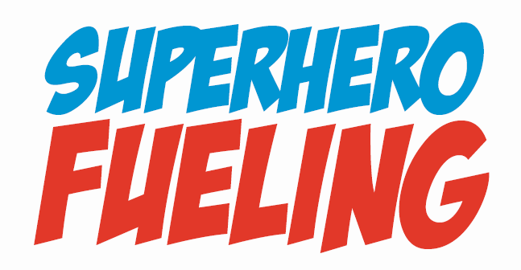

# Superhero-Fueling

### *A way to encourage children to eat better.*

Kids love their superhero! They follow everything their superhero does. Here is an app that can encourage kids to eat better.

Kids can start the app and look at a list of food choices they can eat. They can select up to 3 food items and see how those choices affect their superhero. Healthier choices help our superhero save the day. Bad choices harm our superhero. Kids can also learn fun facts about their food choices and eat better each time they play the game!

## Install

Clone this repostory, then

	npm install
	
> Installation instructions apply only to OS X and Ubuntu. Development environment not tested on other platforms, including Microsoft Windows.

## Usage

The Appgyver Steroids tooling makes it easy to run the application on a mobile device not only for developers, but also for potential clients or testers as well. Once installed, simply run

	steroids connect
	
and a QR code screen should appear in your browser. Then, download the Scanner app from the [App Store](https://itunes.apple.com/us/app/appgyver-scanner/id575076515?mt=8) (iOS) or the [Google Play Store](https://play.google.com/store/apps/details?id=com.appgyver.freshandroid&hl=en) (Android) and use it to scan the QR code. The app will load on your device!

>   Some have reported dependency errors occuring at this stage even after running `npm install`. If this is the case, install the missing dependencies listed in the error manually using `npm install`.

Anyone else who downloads the Scanner app, such as a client or a tester, can also scan the QR code and try the app on their device as well. For more documentaiton on Appgyver Steroids, [look here](http://docs.appgyver.com/supersonic/tutorial/first-mile/).

## Deploying to Cloud

The Appgyver cloud functionality makes it simple to share a qr-code via an http link. To deploy the appgyver application to the cloud, run steroids connect and wait for the screen with the qr code to appear. From here, select "cloud" from the menu on top and click "deploy to cloud." Once this is done, click "open cloud share page." This will redirect you to a sharable html page that you can use to publicize the qr-code.

## Data

Currently, the data is stored inside the `app/common/assets/data/data.json` file. The format of the data is as follows:

	[
	  {
	    "Name":"apple",
	    "Fact":"Apple a day will keep Superman energized all day. This food is very low in Saturated Fat, Cholesterol and Sodium. It is also a good source of Dietary Fiber and Vitamin C.",
	    "Value":5,
	    "Power":"High",
	    "SS":"1 cup (110g)",
	    "Cal":53,
	    "F_g":0,
	    "F_s":"Low",
	    "F_p":0,
	    "SF_g":0,
	    "SF_p":0,
	    "CH_mg":0,
	    "CH_p":0,
	    "S_mg":0,
	    "S_p":0,
	    "C_g":14,
	    "C_s":"Medium",
	    "C_p":0.05,
	    "P_g":0,
	    "P_s":"Low",
	    "EGL":3,
	    "URL":"/images/apple.png",
	    "id":1
	  },
	  {
	  	...etc...
	  }
	 ]
	 
####Keys Explained

* "Name": The name of the food (string)
* "Fact": Helpful facts associated with the food (string)
* "Value": Point value associated with the food. Average of all selected food point values determines whether the user sees a successful animation, a falling animation, or a kryptonite image (number).
* "Power": An indication of how helpful the food is to the superhero (string: "High", "Medium", or "Low")
* "SS": Serving size (string)
* "Cal": Calories (number)
* "F_g": Fat (number, in grams)
* "F_s": Fat scale (string: "High", "Medium", or "Low")
* "F_p": Fat percentage (number)
* "SF_g": Saturated fat (number, in grams)
* "SF_p": Saturated fat percentage (number)
* "CH_mg": Cholesterol (number, in milligrams)
* "CH_p": Cholesterol percentage (number)
* "S_mg": Salt (number, in milligrams)
* "S_p": Salt percentage (number)
* "C_g": Carbohydrates (number, in grams)
* "C_s": Carbohydrates scale (string: "High", "Medium", or "Low")
* "C_p": Carbohydrates percentage (number)
* "P_g": Protein (number, in grams)
* "P_s": Protein scale (string: "High", "Medium", or "Low")
* "EGL": Estimated Glycemic Load (number)
* "URL": Relative url to the image of the food, used as parameter to `ng-src`.

## Status

**The active development of Superhero Fueling by Team Green has ceased.**

The status of the app features implemented are maintained using [our team's Trello Board](https://trello.com/b/GpERMUd6/user-stories
). For more information about Trello, visit [their website](https://trello.com/home).

The completed user story cards are placed under the label "Production". The Product backlog presents the user stories planned for the next version of the app.

## Team

This app was created for the Northwestern EECS 394 Fall 2016 Course by Team Green:

1. Aagam Shah
2. Agam Gupta
3. Collin Pham
4. Joon Park